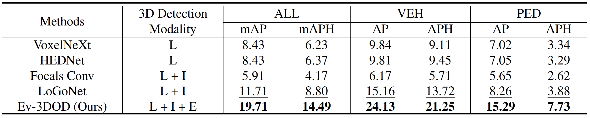
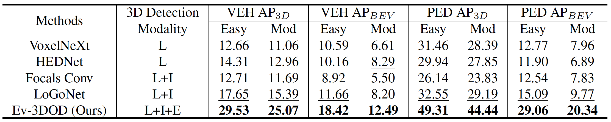

## LiDAR Results
As mentioned in the supplementary material, the main results were obtained using accumulated and processed LiDAR (disparity) data. However, for the convenience of future research, we provide the results of 3D detection using only the LiDAR data from the most recent active timestamp.
### Quantitative Results on the DSEC-3DOD Dataset Using WAYMO Metrics at 100 FPS

### Quantitative Results on the DSEC-3DOD Dataset Using KITTI Metrics at 100 FPS
For convenience, we provide the KITTI evaluation metric. Our labels omit the occlusion and truncation levels, so the results correspond to the 'Easy' and 'Moderate' difficulty levels.
* **Easy**: Min. bounding box height: 40 Px
* **Moderate**: Min. bounding box height: 25 Px
  

