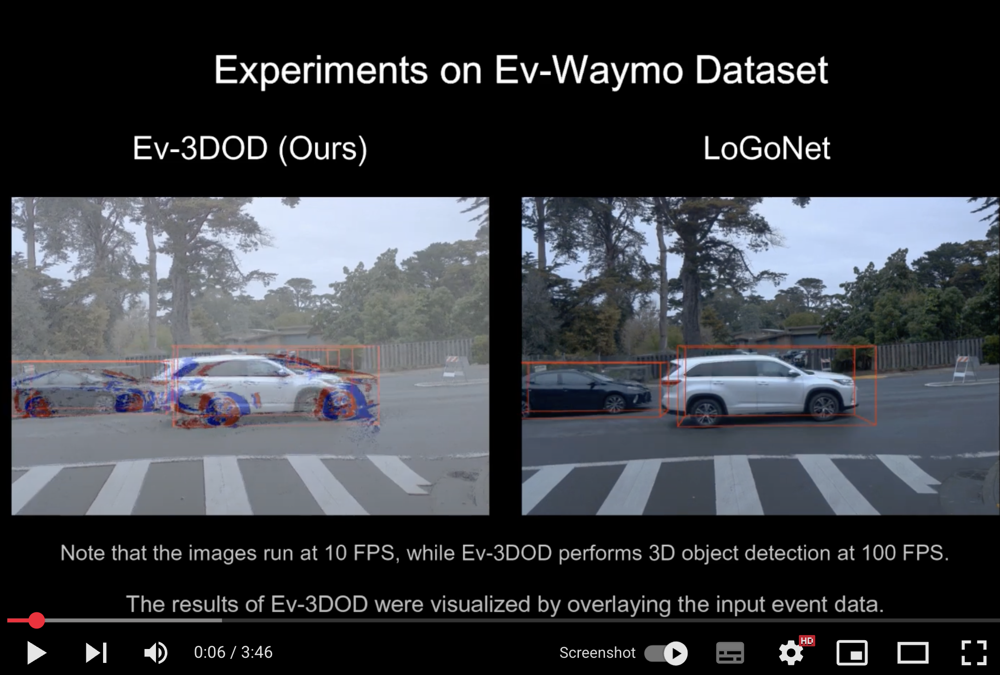
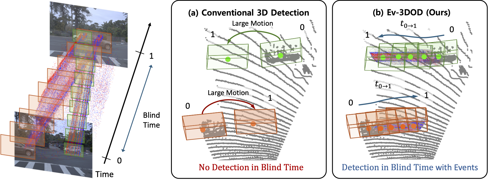
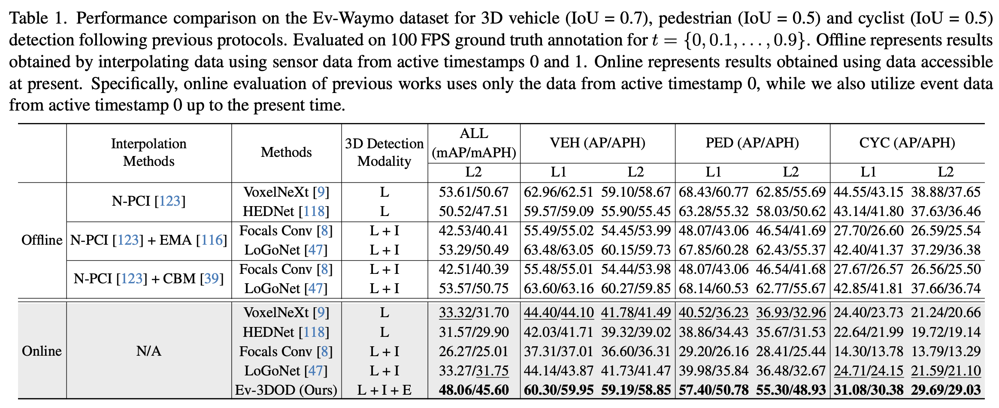
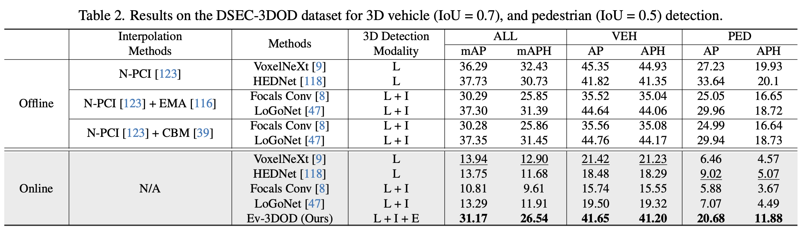

# Ev-3DOD (CVPR 2025 Highlight Paper)
We would like to begin by expressing our sincere gratitude to the reviewers and the area chairs for their valuable feedback and for recognizing the contributions of our paper.

:star2: **Update (09/06/2025)** :star2: We have released train and evaluation codes !

:star2: **Update (31/12/2024)** :star2: We have released Ev-Waymo and DSEC-3DOD datasets !


## Paper
- **[CVPR2025] [Ev-3DOD: Pushing the Temporal Boundaries of 3D Object Detection with Event Cameras](https://openaccess.thecvf.com/content/CVPR2025/papers/Cho_Ev-3DOD_Pushing_the_Temporal_Boundaries_of_3D_Object_Detection_with_CVPR_2025_paper.pdf)**

# :video_camera: Demo Video
A demo video [Youtube](https://youtu.be/JLzVk2TX5FA) can be found by clicking the image below: 
<p align="center">
  <a href="https://youtu.be/JLzVk2TX5FA">
    
  </a>
</p> 

## Framework


Ev-3DOD consists of two training stages. In Stage 1, the model follows a conventional box proposal approach without using event data. In Stage 2, event data is fused with other sensor modalities to enable detection during blind time intervals.


## Downloading Ev-Waymo Dataset
Ev-Waymo dataset can be downloaded from the link [here](https://drive.google.com/drive/folders/1Q-7VjcGx_GTrWrgTXmpoEd02qms81QyK?usp=drive_link).

## Downloading DSEC-3DOD Dataset
DSEC-3DOD dataset can be downloaded from the link [here](https://drive.google.com/drive/folders/1A6XhFxDlqcIgTi28G01fhXBQceaK5vjV?usp=drive_link).


## Running
Please read the corresponding README for details
  - [Data Preprocess](data/DATA_PREPROCESS.md)

  Stage1 (only for 10FPS (not using Events))
  - [Installation](Stage1/docs/INSTALL.md)
  - [Train/Eval](Stage1/docs/STARTED.md)

  Stage2 (100FPS inference (using Events))
  - [Installation](Stage2/docs/INSTALL.md)
  - [Train/Eval](Stage2/docs/STARTED.md)


## Main results

### Results on Ev-Waymo Dataset


### Results on DSEC-3DOD Dataset


Our main paper reports results using the metrics provided by the Waymo Open Dataset. For broader comparability and to facilitate future research, we also re-evaluated the same models using the KITTI metrics. The results can be found at the link below.

- [LiDAR Settings & KITTI Metric](Benchmark/README.md)


## Acknowledgement
We sincerely appreciate the following open-source projects for providing valuable and high-quality codes: 
- [DSEC](https://github.com/uzh-rpg/DSEC)
- [LoGoNet](https://github.com/PJLab-ADG/LoGoNet)
- [mmdetection3d](https://github.com/open-mmlab/mmdetection3d)
- [CenterPoint](https://github.com/tianweiy/CenterPoint)
- [BEVFusion(ADLab-AutoDrive)](https://github.com/ADLab-AutoDrive/BEVFusion)
- [BEVFusion(mit-han-lab)](https://github.com/mit-han-lab/bevfusion)
- [mmdetection](https://github.com/open-mmlab/mmdetection)
- [PDV](https://github.com/TRAILab/PDV)

## Reference
If you find our paper useful, please kindly cite us via:
```
@inproceedings{cho2025ev,
  title={Ev-3dod: Pushing the temporal boundaries of 3d object detection with event cameras},
  author={Cho, Hoonhee and Kang, Jae-young and Kim, Youngho and Yoon, Kuk-Jin},
  booktitle={Proceedings of the Computer Vision and Pattern Recognition Conference},
  pages={27197--27210},
  year={2025}
}
```
## Contact
- If you have any questions regarding datasets and codes, please leave an issue or contact mickeykang@kaist.ac.kr, gnsgnsgml@kaist.ac.kr.

